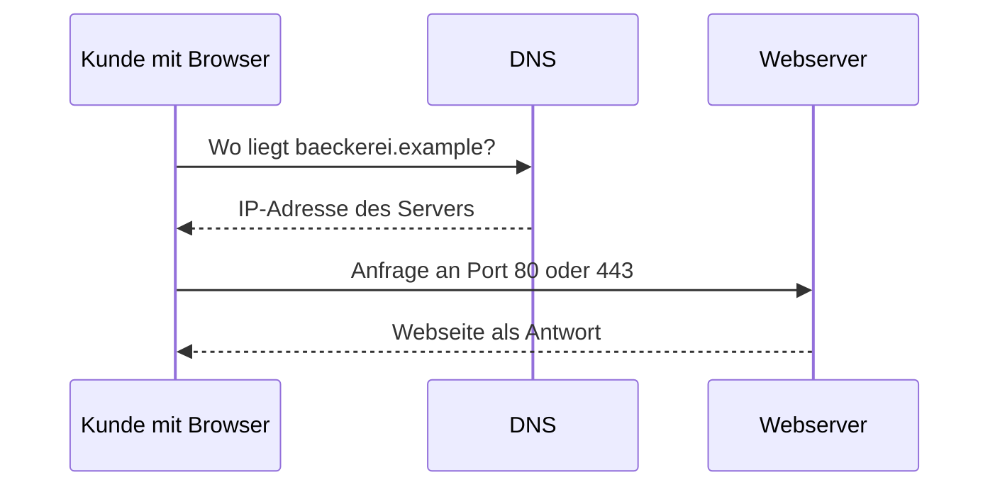

# Modul 2: Netzwerke verstehen & simulieren

## Lab 2.1 – Netzwerk-Grundbegriffe: IP, Port, DNS, Client/Server

---

**Ziel:** IP-Adresse, Port, DNS und Router sowie Client/Server unterscheiden
und an einer Anfrage-Reise nachvollziehen.

- Die Baeckerei-Website soll von drei unterschiedlichen Computern erreichbar sein.
- Eine Anfrage wird im Raum gespielt: Browser, DNS, Router und Webserver geben eine Nachricht weiter.
- Kleingruppen legen denselben Ablauf danach selbst mit Karten aus.
- Ergebnis: eine nachvollziehbare Anfrage-Reise statt einer auswendig gelernten Definition.

Was ist eine IP-Adresse, und wofür braucht man Ports?

Die IP-Adresse ist wie die Hausadresse eines Geräts im Netzwerk – sie sagt,
wohin Daten geschickt werden sollen. Der Port ist wie eine Wohnungsnummer im
selben Haus: er sagt, welcher Dienst auf diesem Gerät die Daten empfangen
soll (z. B. Port 80 für Webseiten).

Wofür ist DNS gut, wenn man doch die IP-Adresse eintippen könnte?

DNS übersetzt gut merkbare Namen (`google.de`) in die tatsächliche
IP-Adresse des Servers – wie ein Telefonbuch, das Namen zu Nummern
zuordnet, damit man sich keine Zahlenfolgen merken muss.

Was unterscheidet einen Client von einem Server?

Der Client fragt etwas an (z. B. "zeig mir diese Webseite"), der Server
liefert die Antwort. Ein Server wartet i. d. R. permanent auf Anfragen,
ein Client stellt sie bei Bedarf.

---

## Grundbegriffe im Überblick

| Begriff    | Alltagsanalogie | Kurzerklärung                                                                 |
| ---------- | --------------- | ----------------------------------------------------------------------------- |
| IP-Adresse | Hausadresse     | eindeutige Adresse eines Geräts im Netzwerk                                   |
| Port       | Wohnungsnummer  | benennt den Dienst auf diesem Gerät (z. B. 80 = Web, 443 = Web verschlüsselt) |
| Router     | Postverteiler   | leitet Datenpakete zwischen Netzwerken weiter                                 |
| DNS        | Telefonbuch     | übersetzt Domainnamen in IP-Adressen                                          |

## Client und Server an der Baeckerei-Website

Der Browser eines Kunden ist der Client. Er fragt nach der Website
`baeckerei.example`. Der Webserver der Baeckerei ist der Server und liefert
die Seite zurueck. DNS hilft dem Browser, den Namen zuerst in eine Adresse zu
uebersetzen.

Übertragen auf IT: der Browser (Client) fragt beim Webserver (Server) eine
Seite an; der Server liefert die Daten zurück, der Browser zeigt sie an.

**Grenze:** Ein Gerät kann gleichzeitig Client und Server sein (z. B. ein
Laptop, der eine Webseite abruft UND einen eigenen kleinen Webserver
betreibt) – die Rolle hängt von der jeweiligen Verbindung ab, nicht vom
Gerätetyp.

## Fazit

- Eine IP-Adresse identifiziert ein Geraet im Netzwerk, ein Port den Dienst darauf.
- DNS uebersetzt einen Namen wie `baeckerei.example` in eine IP-Adresse, bevor der Client den Server erreicht.
- Client und Server sind Rollen einer Verbindung, kein fester Geraetetyp.

Weiter geht es mit der Uebung `l01-network-fundamentals-exc.md`
(Loesung: `l01-network-fundamentals-sol.md`).
