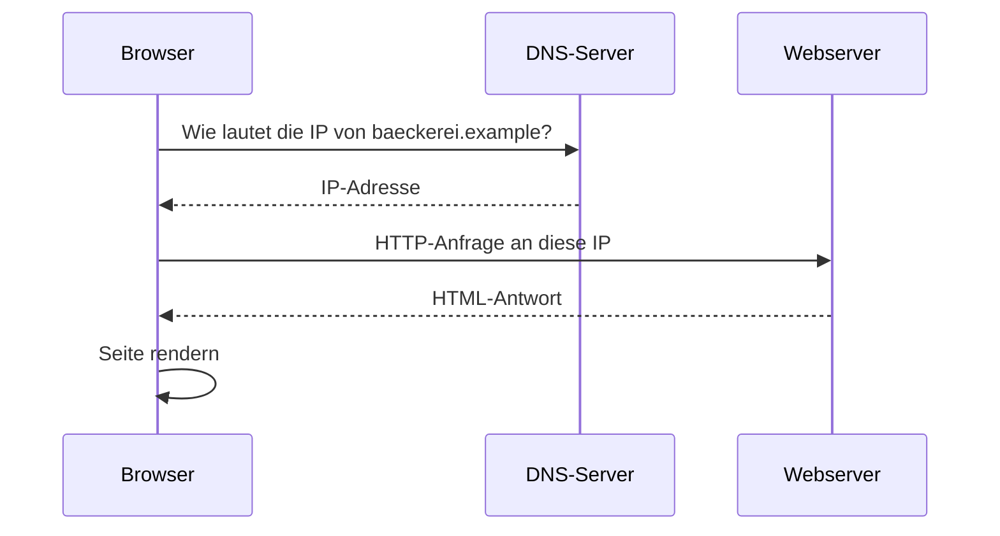

# Modul 2: Netzwerke verstehen & simulieren

## Lab 2.2 – Zwei Container verbinden & eigenen Webserver starten

---

**Ziel:** Zwei Docker-Container per Compose verbinden und einen eigenen
Webserver starten.

- Die Container werden zuerst als zwei kleine Computer betrachtet: Client und Server.
- Die vorbereitete Umgebung zeigt zwei Beweise fuer Kommunikation: Der Client erreicht den Server im Netzwerk, der Browser zeigt die Baeckerei-Website.
- Erst danach vertiefen sich die Begriffe Container, Compose und internes Docker-Netzwerk.

<details>
<summary>Was ist der Unterschied zwischen einer VM und einem Docker-Container?</summary>

Eine VM (virtuelle Maschine) simuliert einen kompletten Computer inklusive
eigenem Betriebssystem-Kernel; ein Docker-Container teilt sich den Kernel
mit dem Host und ist dadurch deutlich leichtgewichtiger und schneller
startbar. Details zu VMs folgen vertieft in Modul 5.

</details>

<details>
<summary>Was passiert technisch, wenn man `google.de` im Browser aufruft?</summary>

Der Browser fragt DNS nach der IP-Adresse, baut eine Verbindung zum
Webserver unter dieser IP auf, sendet eine Anfrage (Request), erhält die
Webseite als Antwort (Response) und rendert sie im Browserfenster.

</details>

<details>
<summary>Warum können zwei Container sich gegenseitig per Name statt IP erreichen?</summary>

Docker Compose richtet für die Container in einer gemeinsamen `docker-
compose.yml` automatisch ein internes Netzwerk mit Namensauflösung ein –
der Servicename aus der Compose-Datei funktioniert wie ein Mini-DNS
innerhalb dieses Netzwerks.

</details>

---

## VMs und Docker im Überblick


|                                 | Virtuelle Maschine (VM)   | Docker-Container                 |
| ------------------------------- | ------------------------- | -------------------------------- |
| Enthält eigenes Betriebssystem? | Ja, vollständig           | Nein, teilt sich den Host-Kernel |
| Startzeit                       | Minuten                   | Sekunden                         |
| Ressourcenbedarf                | hoch                      | gering                           |
| Typischer Einsatz hier          | Modul 5 (lokale/Azure-VM) | Netzwerk- und Deployment-Übungen |

## Was passiert bei `baeckerei.example`?



## Zwei Container verbinden

Eine minimale `docker-compose.yml` mit Client und Server:

```yaml
services:
  client:
    image: alpine
    command: sleep 3600
  server:
    image: nginx
    ports:
      - "8080:80"
```

```bash
docker compose up -d
docker compose exec client ping -c 3 server
```

Der `ping` funktioniert, weil Docker Compose beiden Containern ein
gemeinsames internes Netzwerk und die Namen `client` und `server` zuordnet.

## Eigener Webserver im Container

Der Server-Container veroeffentlicht seinen Port 80 auf Port 8080 des
Rechners. Danach ist die Seite unter `http://localhost:8080` im Browser
erreichbar.

**Grenze:** `ping` prüft nur die Erreichbarkeit auf Netzwerkebene – ein
erfolgreicher `ping` bedeutet nicht automatisch, dass ein Webserver auf
diesem Ziel auch tatsächlich läuft.

## Fazit

- Docker Compose gibt Containern im selben Netzwerk feste Namen, ueber die sie sich gegenseitig erreichen.
- Ein erfolgreicher `ping` zeigt nur Netzwerk-Erreichbarkeit, nicht dass ein Webdienst laeuft.
- Eine Portzuordnung wie `8080:80` verbindet einen Rechnerport mit dem Containerport.

Weiter geht es mit der Uebung `l02-docker-two-containers-exc.md`
(Loesung: `l02-docker-two-containers-sol.md`).
