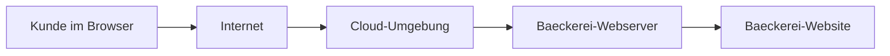

# Modul 2: Netzwerke verstehen & simulieren

## Lab 2.3 - Cloud als Loesung fuer die Baeckerei-Website

---

**Ziel:** IaaS, PaaS und SaaS als unterschiedliche Arten einordnen, IT aus
der Cloud zu nutzen.

- Ausgangspunkt: Die Baeckerei-Website laeuft bisher nur auf einem Kursrechner.
- Leitfrage: Wie kann sie fuer Kunden ausserhalb des Raums erreichbar werden?
- Erst danach folgen die drei Service-Modelle IaaS, PaaS und SaaS.
- Gruppen ordnen konkrete Entscheidungen der Baeckerei zu und begruenden, wer fuer Server, Plattform oder fertige Anwendung verantwortlich ist.

Welches Problem loest Cloud Computing hier?

Ein lokaler Rechner ist nur erreichbar, solange er eingeschaltet, verbunden
und richtig konfiguriert ist. Cloud-Angebote stellen Infrastruktur oder fertige
Dienste in Rechenzentren bereit, die ausserhalb des eigenen Bueros erreichbar
und betreibbar sind.

Was unterscheidet IaaS, PaaS und SaaS?

IaaS liefert grundlegende Infrastruktur wie virtuelle Maschinen. PaaS stellt
eine vorbereitete Plattform fuer Anwendungen bereit. SaaS ist eine direkt
nutzbare Anwendung, zum Beispiel eine Online-Mailbox. Mit jeder Stufe
uebernimmt der Anbieter mehr Betrieb.

Warum ist das kein Rangfolge-Modell?

Die drei Modelle loesen unterschiedliche Aufgaben. Wer eine fertige
Online-Anwendung nutzen will, braucht meist kein eigenes Betriebssystem.
Wer eine spezielle Serverumgebung steuern muss, braucht hingegen mehr
Kontrolle und uebernimmt mehr Verantwortung.

---

## Vom Kursrechner zu Kunden im Internet

Die Cloud ist nicht "irgendwo im Himmel". Sie besteht aus echten Rechnern in
Rechenzentren. Der Unterschied zum Kursrechner liegt vor allem im Betrieb:
Anbieter stellen Ressourcen, Netzwerk und Verfuegbarkeit bereit. Welche Teile
das Baeckerei-Team selbst betreut, haengt vom gewaehlten Service-Modell ab.

## Drei Service-Modelle

| Modell                            | Die Baeckerei bekommt                     | Die Baeckerei betreut selbst       | Konkretes Beispiel    |
| --------------------------------- | ----------------------------------------- | ---------------------------------- | --------------------- |
| IaaS, Infrastructure as a Service | virtuelle Maschine, Speicher, Netzwerk    | Betriebssystem, Anwendungen, Daten | Azure Virtual Machine |
| PaaS, Platform as a Service       | Laufzeitumgebung und Deployment-Plattform | eigene Anwendung und Daten         | Web-App-Plattform     |
| SaaS, Software as a Service       | fertige Online-Anwendung                  | Inhalte, Nutzer und Einstellungen  | Microsoft 365 Mail    |

Eine Merkhilfe: Bei IaaS wird ein leerer Raum gemietet und selbst eingerichtet.
Bei PaaS steht die Werkstatt bereits bereit. Bei SaaS wird ein fertiger Dienst
genutzt. Die Analogie hilft bei der Einordnung, ersetzt aber nicht die reale
Frage nach Verantwortung, Kosten und Berechtigungen.

## Fazit

- IaaS, PaaS und SaaS unterscheiden sich darin, wie viel Betrieb beim Anbieter und wie viel beim eigenen Team bleibt.
- Ein eigener Server im Laden ist keine Cloud-Nutzung, sondern eine lokale Alternative.
- Die Wahl des Modells haengt von Kontrolle, Aufwand und vorhandenem Vorwissen ab, nicht von einer allgemeinen Rangfolge.

Weiter geht es mit der Uebung `l03-cloud-service-models-exc.md`
(Loesung: `l03-cloud-service-models-sol.md`).
