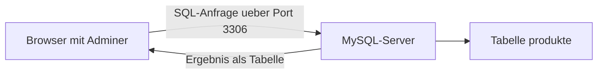

# Modul 4: Datenbanken verstehen & anwenden

## Lab 4.1 - Datenbank und Adminer starten

---

**Ziel:** Datenbank, Tabelle, Spalte und Zeile an einer laufenden Baeckerei-Umgebung sichtbar machen.

- Die vorbereitete Umgebung zeigt Adminer im Browser.
- Danach startet jede Gruppe dieselbe Umgebung und prueft die beiden Dienste.

Warum reicht eine Ordnerablage fuer Bestellungen oft nicht aus?

Viele gleichartige Daten muessen gesucht, verglichen und verlaesslich geaendert werden. Eine Datenbank organisiert sie in einer festen Struktur, damit das auch bei tausenden Datensaetzen zuverlaessig bleibt.

Was ist eine Tabelle?

Eine Tabelle sammelt Datensaetze desselben Typs. Spalten beschreiben Eigenschaften, Zeilen enthalten einzelne Datensaetze.

Wie "sprechen" Adminer und MySQL miteinander?

Adminer ist selbst keine Datenbank, sondern nur eine Bedienoberflaeche. Adminer baut ueber das Netzwerk eine Verbindung zu MySQL auf (Adresse plus Port, standardmaessig 3306), schickt eine SQL-Anfrage und MySQL schickt das Ergebnis als Tabelle zurueck. Ohne laufenden MySQL-Dienst kann Adminer nichts anzeigen.

## Datenbanktypen im Ueberblick

Nicht jede Datenbank speichert Daten auf die gleiche Art. Fuer den Alltag reichen drei Grundformen:

| Typ                       | Speichert Daten als                      | Beispiel-System   | Typischer Einsatz                                     |
| ------------------------- | ---------------------------------------- | ----------------- | ----------------------------------------------------- |
| Relational (SQL)          | Tabellen mit festen Spalten              | MySQL, PostgreSQL | Kunden, Produkte, Bestellungen mit klaren Beziehungen |
| Dokumentenbasiert (NoSQL) | verschachtelte Dokumente (JSON-aehnlich) | MongoDB           | Daten mit wechselnder Struktur, z. B. Produktkataloge |
| Key-Value                 | einfache Schluessel-Wert-Paare           | Redis             | sehr schneller Zwischenspeicher, z. B. Sitzungsdaten  |

Dieses Modul nutzt MySQL (relational) direkt und vergleicht es in Lab 4.3 mit MongoDB (dokumentenbasiert).

## Die sichtbaren Teile

| Teil    | Aufgabe                                 |
| ------- | --------------------------------------- |
| MySQL   | speichert relationale Daten             |
| Adminer | zeigt und bearbeitet Daten im Browser   |
| Tabelle | sammelt Datensaetze, etwa Produkte      |
| Spalte  | beschreibt eine Eigenschaft, etwa Preis |
| Zeile   | beschreibt ein einzelnes Produkt        |

- Adminer ohne laufende Datenbank kann keine Daten anzeigen.
- Beispielwerte bleiben anonym und enthalten keine echten Kundendaten.

## Fazit

- Datenbanken machen gleichartige Daten durchsuchbar und aenderbar.
- Adminer ist eine Browser-Oberflaeche fuer die Datenbank.
- Tabellen bestehen aus Spalten und Zeilen.

Weiter geht es mit der Uebung `l01-start-adminer-mysql-exc.md` (Loesung: `l01-start-adminer-mysql-sol.md`).
