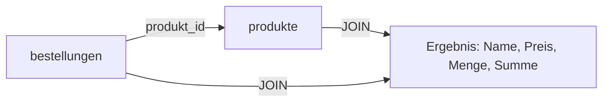

# Modul 4: Datenbanken verstehen & anwenden

## Lab 4.4 - Bestellungen, Verknuepfungen und Auswertungen

---

**Ziel:** Eine zweite Tabelle mit Bezug zu `produkte` anlegen und daraus mit JOIN und Summen eine echte Auswertung bilden, danach dieselbe Auswertung in MongoDB nachbauen.

- Bisher stand jedes Produkt einzeln in `produkte`. Eine Bestellung bezieht sich aber immer auf ein vorhandenes Produkt.
- Eine Fremdschluessel-Spalte verknuepft `bestellungen` mit `produkte`, ohne Daten doppelt zu speichern.
- Ein JOIN fuehrt beide Tabellen fuer eine Abfrage wieder zusammen; SUM und GROUP BY bilden daraus eine Auswertung je Produkt.
- MongoDB kennt keine feste Fremdschluessel-Regel, bietet mit `$lookup` aber einen aehnlichen Verknuepfungsschritt in einer Aggregation.

Warum reicht eine einzige Tabelle fuer Produkte und Bestellungen nicht?

Ein Produkt wie "Brot" wird in vielen Bestellungen verwendet. Stuende Name und Preis in jeder Bestellzeile erneut, muesste eine Preisaenderung an vielen Stellen gleichzeitig gepflegt werden. Eine eigene Bestelltabelle verweist stattdessen nur auf die vorhandene Produkt-ID.

Was macht ein JOIN?

Ein JOIN fuehrt Zeilen aus zwei Tabellen anhand eines gemeinsamen Wertes zusammen, hier die Produkt-ID. Aus einer Bestellzeile und der passenden Produktzeile entsteht so eine gemeinsame Ergebniszeile mit Produktname, Preis und Menge.

Was bedeutet GROUP BY mit SUM?

GROUP BY fasst alle Zeilen mit demselben Wert (z. B. derselben Produkt-ID) zu einer Gruppe zusammen. SUM addiert dann einen Wert je Gruppe, zum Beispiel den Umsatz aller Bestellungen eines Produkts.

## Von einer Tabelle zu zwei verknuepften Tabellen

| Tabelle        | Spalten                             | Bezug                                   |
| -------------- | ----------------------------------- | --------------------------------------- |
| `produkte`     | id, name, preis                     | bleibt wie in Lab 4.2 unveraendert      |
| `bestellungen` | id, produkt_id, menge, bestelldatum | `produkt_id` verweist auf `produkte.id` |

## SQL-Auswertung im Ueberblick

| Aufgabe                       | SQL-Baustein        |
| ----------------------------- | ------------------- |
| Zwei Tabellen zusammenfuehren | `JOIN ... ON`       |
| Preis mal Menge je Bestellung | `preis * menge`     |
| Umsatz je Produkt summieren   | `SUM(...) GROUP BY` |

## Dieselbe Auswertung in MongoDB

MongoDB speichert die neue Sammlung `bestellungen_referenziert` mit einer Referenz auf die `_id` des Produkt-Dokuments, statt wie die bestehende Sammlung `bestellungen` aus Lab 4.3 den Produktnamen direkt einzubetten. Die Aggregation `$lookup` holt sich daraus die passenden Produktdaten, `$group` mit `$sum` bildet danach denselben Umsatz je Produkt wie die SQL-Loesung.

- `$lookup` verbindet zwei Sammlungen ueber ein gemeinsames Feld, aehnlich einem JOIN.
- `$group` mit `$sum` fasst Dokumente zu einer Auswertung zusammen, aehnlich GROUP BY/SUM.

## Fazit

- Eine Fremdschluessel-Spalte verknuepft zwei Tabellen, ohne Daten doppelt zu speichern.
- JOIN fuehrt verknuepfte Tabellen fuer eine Abfrage zusammen.
- GROUP BY mit SUM bildet Auswertungen je Gruppe, etwa Umsatz je Produkt.
- MongoDB bildet dieselbe Auswertung mit `$lookup` und `$group` in einer Aggregation nach.

Weiter geht es mit der Uebung `l04-baeckerei-bestellungen-praxis-exc.md` (Loesung: `l04-baeckerei-bestellungen-praxis-sol.md`).
